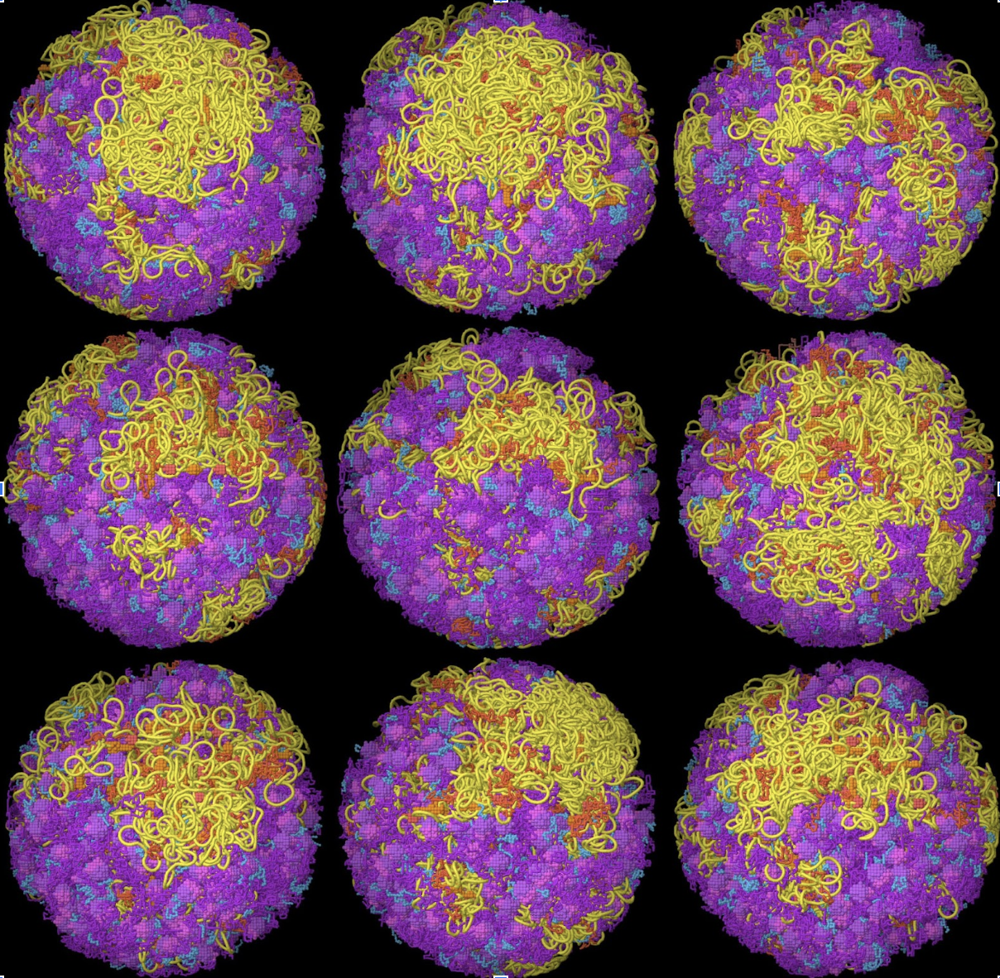

# ModularNucleoid
Software for Generating Models of JCVI-Syn3A Nucleoids
May 2023, David S. Goodsell, provided as is for unrestricted use.

ModularNucleoid is used to generate models of the minimal genome bacterium JCVI-Syn3A, producing a series of models that test hypotheses about transcription, condensation, and overall distribution of the genome. 

<p align="center" float="left">
  
   
</p>

## Input Files
1. `syn3Asmall_ribosomes.pdb`: Centroids of ribosomes from cryoEM in nm, should be centered on the origin.
2. `4v6k_mask.pdb`: Mask file for ribosome (lattice coordinates=3.4nm).
3. `6c6u_mask.pdb`: Mask file for RNA polymerase.
4. `7nyx_mask.pdb`: Mask file for SMC.
5. `syn3A.genome`: RNA polymerase positions and genomic information
                 position of RNApol (bp), length of mRNA (bases),
                 length of segment between pol and previous pol (bp),
                 direction of transcription (1 or -1),
                 transcribed (1) or noncoding (0),
                 gene ID, common name of gene product

## Compiling Source Code
```bash
gfortran generate_connect.f -o generate_connect
gfortran generate_pol.f subroutines.f -o generate_pol
gfortran modularlattice.f subroutines.f -o modularlattice
gfortran relax.f -o relax
```

## Scripts

- `syn3A.script`: Includes the entire pipeline. The script includes a for loop for generating multiple instances of a particular model. In tests, the `modularlattice` step fails roughly half of the time due to crowding, so repeat with a different random seed.
- `jmol.script`: Includes a short script for Jmol for visualizing lattice models and relaxed models.

## Pipeline
1. **Generate connectivity information with `generate_connect.f`**
    - Generates a ".connect" file used by ModularLattice.
    - This version is hardwired for a syn3A genome with 54300 beads, lattice units of 10 bp/bead.
    - Reads genome information from an input file with RNApol positions and nascent mRNA length.
    - SMC loops are placed between RNApol positions greater than a user defined minimum DNA segment length.
    - Mature mRNA is chosen randomly from nascent mRNA length, and one ribosome is placed at the center.
    - Input parameters: 
        - `syn3A.genome`      #genome file with RNApol positions and mRNA length (bp units)
        - `syn3A.connect`     #output .connect file
        - `503,187,187`       #number of ribosomes, RNApol, and SMC
        - `120`               #minimum DNA length to add SMC (lattice units)
```bash
./generate_connect syn3A.genome syn3A.connect 503,187,187 120
```

2. **Generate positions of RNA polymerase, ribosomes, and SMC with `generate_pol.f`**
    - Reads ribosome positions and generates RNApol positions using a random walk.
    - SMC is placed between RNApol positions.
    - Hardwired for lattice units of 10bp/bead.
    - Input parameters:
        - `syn3Asmall_ribosomes.pdb`: Ribosome positions (nm, should be centered on origin)
        - `6c6u_mask.pdb`: Mask file for RNApol
        - `4v6k_mask.pdb`: Mask file for ribosome
        - `7nyx_mask.pdb`: Mask file for SMC
        - `syn3A.pdb`: Output coordinate file (lattice units)
        - `187`: Number of RNApol and SMC
        - `201.26`: Radius of cell (nm)
        - `1234`: Random seed
        - `20.`: Max distance between successive RNApol
        - `RANDOM`: RANDOM or CIRCLE placement of RNApol
```bash
./generate_pol syn3Asmall_ribosomes.pdb 6c6u_mask.pdb 4v6k_mask.pdb 7nyx_mask.pdb syn3A.pdb 187 201.26 1234 20. RANDOM
```
**Note:** Uses a wasteful approach that repeats RNApol generation until a closed circular genome is obtained.

3. **Generate lattice model of genome with `modularlattice.f`**
    - Reads coordinates of RNApol, ribosomes and SMC from `generate_pol.f`, and DNA/RNA chain lengths and connectivity from `generate_connect.f`.
    - Creates lattice model of DNA, nascent/mature mRNA, and nascent protein.
    - Input parameters: `syn3A.pdb`, `syn3A.connect`, `syn3A_lattice.pdb`, `0`, `1234`, `60.`
        - `syn3A.pdb`:           input coordinate file with RNApol, ribosome, SMC templates
        - `syn3A.connect`:       input file that defines DNA/RNA chain lengths and connections
        - `syn3A_lattice.pdb`:   output lattice coordinates
        - `0`:                   supercoiling number of DNA beads per turn
        - `1234`:                random seed
        - `60.`:                 cell radius (lattice units)
```bash
./modularlattice syn3A.pdb syn3A.connect syn3A_lattice.pdb 0 1234 60.
```
**Note:** Largely hardwired for syn3A with simple RNApol, ribosomes, and SMC. In tests with syn3A models, fails ~half of the time due to crowding! Try again with a different random seed.

4. **Optimize the model with `relax.f`**
    - Relaxes a set of lattice coordinates using a simple force field.
    - Molecule positions and control points from `generate_pol.f` are held rigid.
    - Input parameters:
        - `syn3A_lattice.pdb`:      input lattice coordinates
        - `syn3A_relax.pdb`:        output relaxed coordinates
        - `1500`:                   optimization steps
```bash
./relax syn3A_lattice.pdb syn3A_relax.pdb 1500
```
